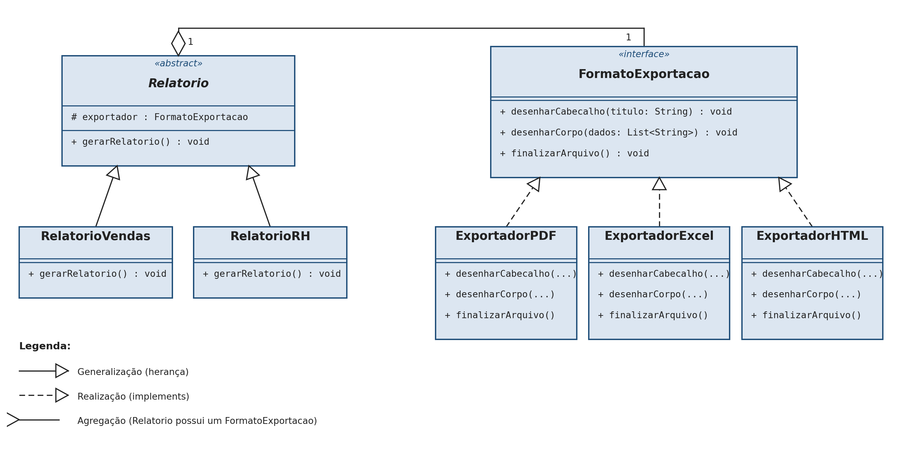
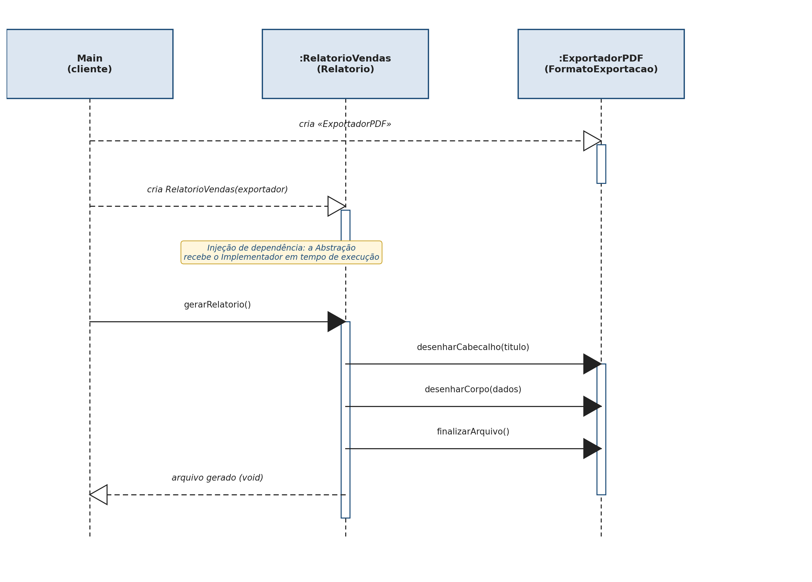

# Módulo de Relatórios — TechFatec (Padrão Bridge)

Projeto acadêmico que expande o módulo de relatórios de um sistema de
inteligência de negócios. O sistema legado gerava exclusivamente o
**Relatório de Vendas** em **PDF**. O novo requisito adiciona o
**Relatório de Desempenho de RH** e exige que **todos** os relatórios
(atuais e futuros) sejam exportáveis para **PDF**, **Excel (XLSX)** e
**HTML** — sem explosão de subclasses e respeitando o **Princípio
Aberto/Fechado (OCP)** do SOLID.

A solução aplica o **padrão de projeto Bridge**, desacoplando a hierarquia
de **tipos de relatório** (Abstraction) da hierarquia de **formatos de
exportação** (Implementor), de modo que as duas evoluam de forma
independente.

## Diagramas (Fase 1)

### Diagrama de Classes



- **Abstraction** — `Relatorio`: classe abstrata que mantém a referência
  protegida `exportador : FormatoExportacao` e define `gerarRelatorio()`.
- **Refined Abstraction** — `RelatorioVendas` e `RelatorioRH`: especializam
  o conteúdo (título e dados) de cada tipo de relatório.
- **Implementor** — `FormatoExportacao`: interface com
  `desenharCabecalho(titulo)`, `desenharCorpo(dados)` e `finalizarArquivo()`.
- **Concrete Implementor** — `ExportadorPDF`, `ExportadorExcel`,
  `ExportadorHTML`: implementam a renderização concreta em cada formato.
- **Relacionamento** — agregação entre `Relatorio` e `FormatoExportacao`:
  o relatório *possui* um exportador, mas não é responsável pelo seu ciclo
  de vida.

### Diagrama de Sequência



O `Main` (cliente) instancia o exportador concreto, injeta-o no construtor
de `RelatorioVendas` e chama `gerarRelatorio()`, que delega
`desenharCabecalho()` → `desenharCorpo()` → `finalizarArquivo()` ao
exportador — sem conhecer sua implementação interna.

## Arquitetura de diretórios (Fase 2)

```
projeto-bridge/
├── README.md
├── .gitignore
├── diagramas/
│   ├── diagrama_classes.png
│   └── diagrama_sequencia.png
└── src/
    ├── abstracao/
    │   ├── Relatorio.java          (Abstraction)
    │   ├── RelatorioVendas.java    (Refined Abstraction)
    │   └── RelatorioRH.java        (Refined Abstraction)
    ├── implementacao/
    │   ├── FormatoExportacao.java  (Implementor)
    │   ├── ExportadorPDF.java      (Concrete Implementor)
    │   ├── ExportadorExcel.java    (Concrete Implementor)
    │   └── ExportadorHTML.java     (Concrete Implementor)
    └── cliente/
        └── Main.java               (Client / script de validação)
```

Cada pasta corresponde a um lado do padrão Bridge: `abstracao` nunca
importa uma implementação concreta de `implementacao` — apenas a interface
`FormatoExportacao`. Quem conecta os dois lados é `cliente`.

## Injeção de dependência

É **estritamente vedado** instanciar um exportador concreto (`new
ExportadorPDF()`, por exemplo) dentro de `Relatorio` ou de suas subclasses.
A dependência é sempre recebida de fora:

- **Via construtor**, na criação do relatório:
  ```java
  protected Relatorio(FormatoExportacao exportador) {
      this.exportador = exportador;
  }
  ```
- **Via setter**, para trocar o formato em tempo de execução sem recriar o
  objeto:
  ```java
  public void setExportador(FormatoExportacao exportador) {
      this.exportador = exportador;
  }
  ```

O único lugar do projeto onde a palavra-chave `new` é usada sobre um
exportador concreto é em `cliente/Main.java` — o ponto de composição do
padrão.

## Como compilar e executar

Requer JDK 17+ instalado.

```bash
# a partir da raiz do projeto
mkdir -p out
javac -d out $(find src -name "*.java")
java -cp out cliente.Main
```

## Script de validação — o que `Main.java` comprova

| # | Rotina | Comprova |
|---|--------|----------|
| 1 | Gera o Relatório de Vendas em **PDF** | Injeção via construtor |
| 2 | Troca **a mesma instância** de `RelatorioVendas` para **Excel** em tempo de execução | Injeção via setter — o objeto não é recriado |
| 3 | Gera o Relatório de Desempenho de **RH** em **HTML** | Uma nova Refined Abstraction reaproveitando os mesmos exportadores, sem alterar nenhuma classe existente |

### Saída esperada no console (resumo)

```
=========================================================
Rotina 1: Relatorio de Vendas exportado em PDF
=========================================================
[PDF] Cabecalho renderizado -> Relatorio de Vendas
[PDF] Corpo do documento (3 registro(s)):
       [PDF] * Pedido #1042 - Notebook Gamer - R$ 4.899,00
       ...
[PDF] Arquivo finalizado -> relatorio.pdf

=========================================================
Rotina 2: MESMO relatorio de vendas, agora em Excel (troca em runtime)
=========================================================
[XLSX] Celula A1 preenchida -> Relatorio de Vendas
       ...
[XLSX] Planilha finalizada -> relatorio.xlsx

=========================================================
Rotina 3: Relatorio de Desempenho de RH exportado em HTML
=========================================================
[HTML] <h1>Relatorio de Desempenho de RH</h1>
       ...
[HTML] Arquivo finalizado -> relatorio.html
```

## Por que isso é o padrão Bridge e não apenas "polimorfismo comum"

Herança direta (`RelatorioVendasPDF`, `RelatorioVendasExcel`,
`RelatorioRHHTML`, ...) cresceria em **N × M** classes a cada novo tipo de
relatório ou formato. Aqui, `Relatorio` (N tipos) e `FormatoExportacao`
(M formatos) crescem **independentemente**: um novo formato (ex.:
`ExportadorJSON`) não exige tocar em `RelatorioVendas` ou `RelatorioRH`, e
um novo tipo de relatório não exige tocar em nenhum exportador — cumprindo
o Princípio Aberto/Fechado do SOLID.

## Dupla

_Preencher com os nomes da dupla responsável por esta atividade._
